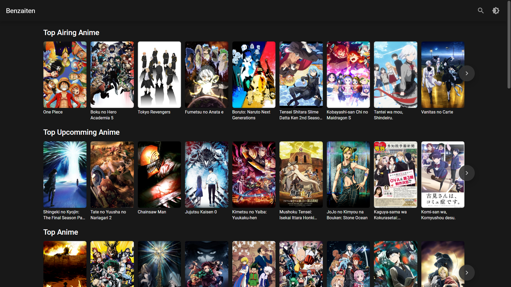
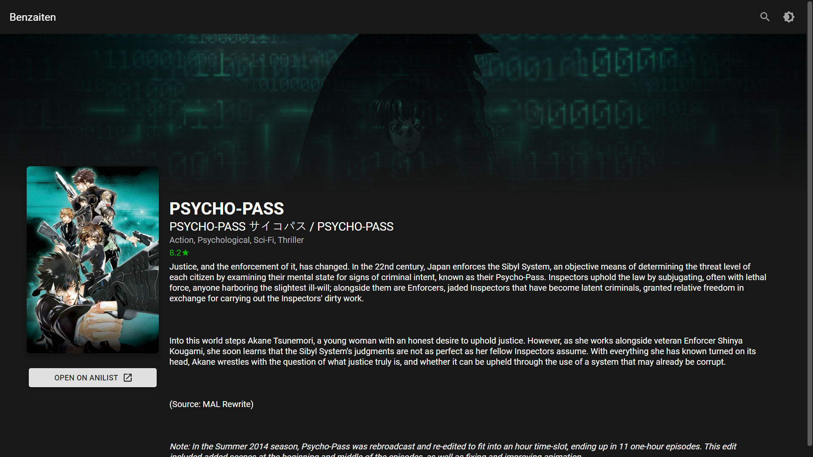
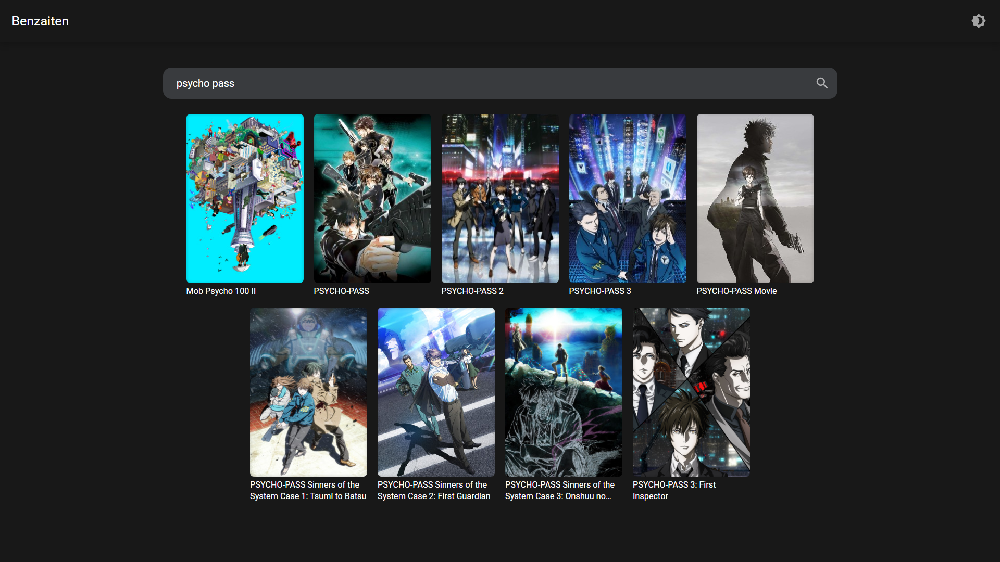
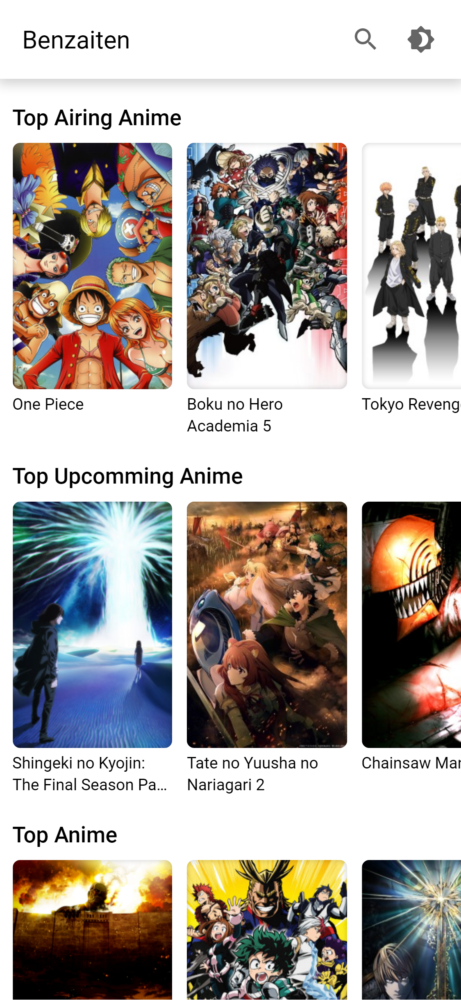
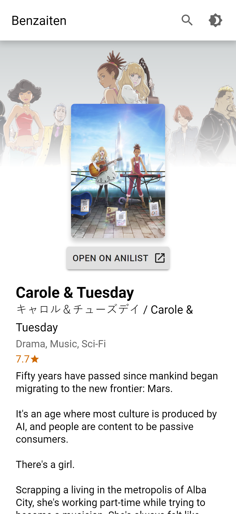
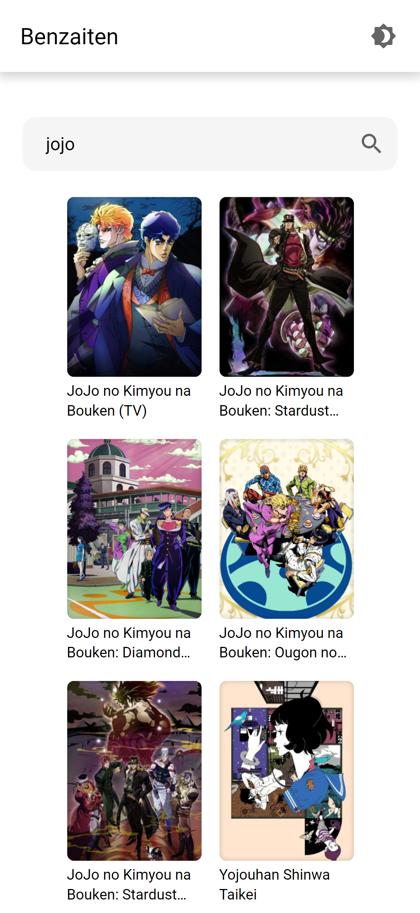

# Benzaiten

[Live Preview](https://benzaiten-vzcatus13.netlify.app/)

Benzaiten is front-end web application which I wrote to learn more about React.

##

As the end result I know more about React, Styled Components (and CSS Modules as well SCSS, but here they don't used here), GraphQL (Apollo Client), because project utilize [AniList's API](https://anilist.gitbook.io/anilist-apiv2-docs/)

## Screenshots

### Desktop
 
 

### Mobile
|  |  |  |
|---|---|---|

## Help (Contribute)

If you somehow seeing this message and you're not robot, you can help me with any human advice (because this project is educational), including, but not limited to, code styles, files and folder structure, best, but not overkilled, practices. To advise open issue or email me.